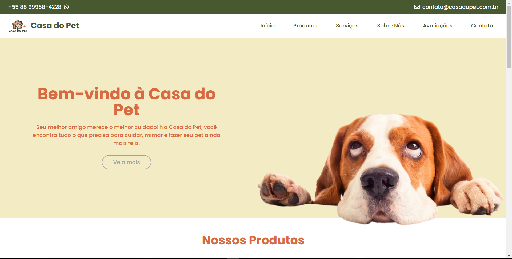

# Casa do Pet 🐾
### Bem-vindo ao repositório do site Casa do Pet! Este é o espaço onde reunimos todas as informações, código e recursos necessários para o desenvolvimento e manutenção do nosso site. A Casa do Pet é um petshop online dedicado a oferecer os melhores produtos e serviços para os pets e seus tutores, sempre com carinho e qualidade.

# 🌟 Sobre o Projeto
### O site da Casa do Pet foi desenvolvido com o objetivo de oferecer uma experiência amigável e intuitiva para nossos usuários. Aqui, os clientes podem acessar informações sobre nossos produtos e serviços, além de dicas para o cuidado com seus pets. O design foi pensado para refletir a energia e o amor que temos pelos animais.

# 🛠️ Tecnologias Utilizadas
## HTML5 e CSS3: Estrutura e design do site.
## Tailwind CSS: Framework para estilização responsiva.

